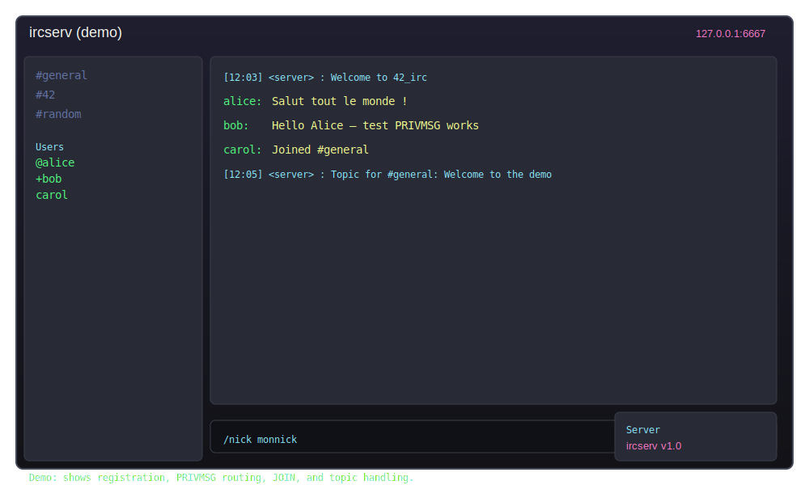
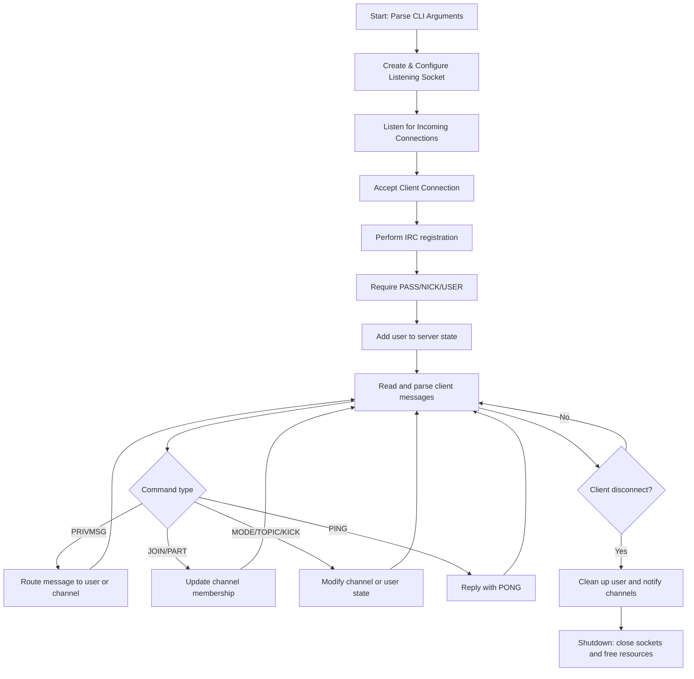

# 42_irc - IRC Server

This repository contains a simple IRC server implementation used for learning socket programming and protocol parsing. The demo shows the server handling multiple clients, channel joins, messages, and basic command flow.

## Demo



## Workflow Diagram



- **Initialization Phase**: Parses command-line arguments (port, optional password), initializes server sockets, and prepares internal data structures for users and channels.
- **Connection Handling Phase**: Accepts TCP connections from IRC clients and performs the registration handshake (PASS/NICK/USER) according to the project's specification.
- **Command Processing Phase**: Parses incoming IRC messages, validates commands, executes actions (e.g. PRIVMSG, JOIN, PART, MODE), and routes replies to the appropriate clients.
- **Channel & User Management Phase**: Maintains channel lists, user states, and implements basic mode handling and permission checks.
- **Cleanup Phase**: On termination or client disconnect, removes users from channels, notifies remaining users where applicable, and closes sockets.

## Network Testing Environment

Typical components used when testing this server locally or in a small test network:

- **Server**: The compiled `ircserv` binary running on a chosen port. It accepts client connections and manages channels/users.
- **Clients**: IRC clients such as `irssi`, `weechat`, `HexChat`, or simple telnet/netcat sessions for manual testing.
- **Test Scripts / Tools**: Optional client simulation scripts or small programs to automate registrations, joins, messages, and stress tests. Useful tools include `nc`/`telnet`, Python scripts using sockets, or dedicated IRC bot scripts.

Examples of manual tests:
- Connect two clients, register with NICK/USER, and exchange PRIVMSGs.
- Create and join channels, set topics, and test KICK/MODE behaviors.
- Send malformed commands to validate server parsing and error replies.

## Requirements

- Linux (development and testing assumed on a POSIX-compliant system)
- C++ compiler (g++/clang++) supporting at least C++98
- Make to build the project
- POSIX sockets support (native on Linux)

## Build and run (example):

   ```
   make
   ./ircserv <port> [password]
   ```
Replace `<port>` with the desired TCP port (e.g. 6667) and provide a password if the server enforces one.

### Optional tools for testing and debugging:
- `valgrind` for memory checks
- `gdb` for debugging
- `telnet` / `nc` for quick manual interactions
